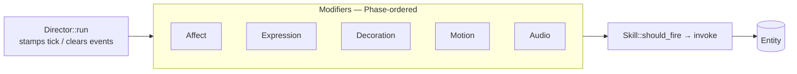

# stackchan-core

`no_std` engine for the Stack-chan NPC. An [`Entity`] holds the
per-frame state — face, motor, perception, voice, mind, events, input,
tick — and a [`Director`] runs registered [`Modifier`]s and [`Skill`]s
against it each frame. No hardware, OS, or `alloc` dependency beyond
the workspace `extern crate alloc` for `heapless::String`-adjacent
use; the firmware and the simulator both consume this crate against
the same trait surface.

## What's here

- [`Entity`] — composed NPC state (`face`, `motor`, `perception`,
  `voice`, `mind`, `events`, `input`, `tick`, `led_override`).
  Plain data — modifiers and skills mutate it in place.
- [`Director`] — orders modifiers by `(Phase, priority, registration
  order)` and ticks them each frame; polls skills and invokes those
  whose `should_fire` predicate returns `true`. Caller owns the
  modifier / skill instances; the Director only borrows.
- [`Modifier`] — per-frame state mutator with `meta()` (phase, priority,
  declared reads / writes) and `update(&mut Entity)`. The canonical
  catalogue lives in [`modifiers/`](src/modifiers).
- [`Skill`] — longer-running NPC capability with `meta()`,
  `should_fire`, and `invoke`. Skills write `mind` / `voice` /
  `events`; modifiers translate that intent into face and motion. The
  catalogue lives in [`skills/`](src/skills).
- [`Clock`] — single-method trait (`fn now(&self) -> Instant`) used so
  modifiers stay deterministic for host tests against a `FakeClock`.

The trait shapes are the public surface; new behaviour ships as a new
file in `modifiers/` or `skills/` rather than as a Director edit.

## Tick model

[`Phase`](src/director.rs) declares the canonical NPC tick order —
`Perception → Cognition → Affect → Speech → Expression → Decoration →
Motion → Audio → Output`. Today the populated phases are `Affect`,
`Expression`, `Decoration`, `Motion`, `Audio`; the rest are reserved
slots. Skills are polled after the modifier pass so they observe the
post-modifier entity state.

`entity.tick.now` is stamped by [`Director::run`]; modifiers read it
instead of taking `now: Instant` as an argument. `tick.dt_ms` carries
the delta since the previous frame; `tick.frame` is a monotonic
counter.

## Conflict detection

Modifiers declare their `reads` and `writes` as `&'static [Field]`
slices on [`ModifierMeta`]. In `cfg(debug_assertions)` builds the
Director snapshots [`Entity`] before each invocation and panics if a
modifier mutates a field outside its declared `writes` set. [`Field`]
is per-leaf (`LeftEyePhase` vs `LeftEyeWeight`) so two modifiers
writing different sub-fields of the same component don't false-flag
as conflicts. Release builds skip the check.

## Storage

[`Director`] uses `heapless::Vec` for the modifier and skill
registries with caps [`MODIFIER_CAP`] and [`SKILL_CAP`]. Modifiers
own their per-frame state in fixed-size fields. Callers that want N
copies of a modifier build a wrapper — the crate won't `Box`
anything.

## Gotchas

1. **No `alloc` in the modifier path.** `alloc` is available
   crate-wide (`extern crate alloc`) for string-typed types like
   `Voice::utterance_request`, but per-frame modifier work avoids
   it. New modifiers should follow suit.
2. **Time must be monotonic.** `Clock::now()` is trusted; a backward
   jump breaks modifiers that compare against `last_update`. Wall-clock
   sources need a wrapper.
3. **Render is pure.** `Face::draw` (via the [`draw`] module) produces
   pixels into the caller's `embedded_graphics::DrawTarget<Color =
   Rgb565>`; it doesn't mutate the entity. Run the Director first,
   then render.
4. **Skills don't draw or move.** They write `mind` / `voice` /
   `events`. Translation to face / motor is the modifiers' job — this
   keeps the cognitive layer decoupled from the rendering and motion
   pipelines and is the invariant the field-conflict check protects.
5. **No `unwrap` / `expect` / `panic` in library code.** Workspace
   lints deny them. APIs saturate or return typed errors on
   pathological input.

## Integration

- [`stackchan-firmware`](../stackchan-firmware) registers modifiers
  and skills, drains hardware signals into `entity.perception` /
  `entity.input`, then calls `Director::run` per render tick.
- [`stackchan-sim`](../stackchan-sim) does the same composition
  against a `FakeClock` and a `Vec<Rgb565>` framebuffer for golden
  snapshots.
- Unit-tested via doctests and per-module `#[cfg(test)]` blocks;
  golden-behaviour tests live in `stackchan-sim`.
- **Stability:** `Experimental` in v0.x. Trait shapes and the [`Entity`]
  composition are settled; individual modifier / skill names and
  field internals continue to evolve.

[`Entity`]: src/entity.rs
[`Director`]: src/director.rs
[`Director::run`]: src/director.rs
[`Modifier`]: src/modifier.rs
[`ModifierMeta`]: src/director.rs
[`Skill`]: src/skill.rs
[`Phase`]: src/director.rs
[`Field`]: src/director.rs
[`Clock`]: src/clock.rs
[`MODIFIER_CAP`]: src/director.rs
[`SKILL_CAP`]: src/director.rs
[`draw`]: src/draw.rs
