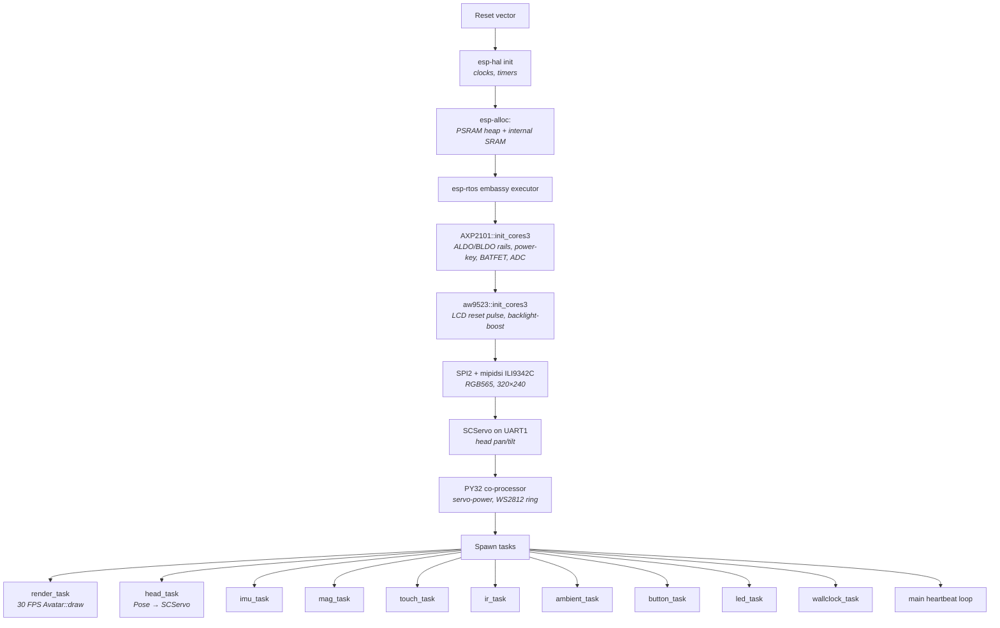

# stackchan-firmware

Binary crate. `no_std` + `alloc`, embassy executor on esp-rtos, runs on
the M5Stack CoreS3 Stack-chan. Boots the hardware, wires up every
driver, spawns the embassy task set, and runs the `stackchan-core`
modifier pipeline at ~30 FPS.

## Key Files

- `src/main.rs` — binary entry: heap init, esp-rtos boot, board init, task spawn, heartbeat loop
- `src/lib.rs` — shared library surface (modules the main binary + `examples/*.rs` both use)
- `src/board.rs` — `BoardIo`, `SharedI2c(Bus)`, `HeadDriverImpl`. One-shot hardware bring-up: AXP2101 → AW9523 → SPI2 ILI9342C via mipidsi → SCServo UART
- `src/framebuffer.rs` — PSRAM-backed 320×240 RGB565 double-buffer + dirty-check blit
- `src/clock.rs` — `HalClock` wraps `embassy_time::Instant` to implement `stackchan_core::Clock`
- `src/head.rs` — embassy task: `stackchan_core::Pose` → SCServo commands
- `src/imu.rs` / `src/mag.rs` — BMI270 / BMM150 tasks publishing to signal channels for the 9-axis data path
- `src/touch.rs` / `src/ir.rs` / `src/ambient.rs` / `src/button.rs` / `src/leds.rs` / `src/wallclock.rs` — per-peripheral tasks
- `src/audio.rs` — I²S0 + codec bring-up, then RX RMS loop (publishing on `AUDIO_RMS_SIGNAL`) + TX feeder (1 kHz boot greeting then silence) running concurrently via `embassy_futures::join`
- `examples/bench.rs` — calibration bench, flashed via `just bench`
- `examples/{aw88298,es7210,imu,mag,leds,ambient,touch,ir}_bench.rs` — per-driver control-path benches (chip-ID probe + init + heartbeat; the streaming I²S path runs only inside `src/audio.rs` in the main firmware)

## Boot Sequence



## Modifier Stack

Main spawns a render task that runs this stack per tick:

```
RemoteCommand → EmotionTouch → AmbientSleepy → PickupReaction →
EmotionCycle → EmotionStyle → EmotionHead → IdleDrift → IdleSway →
Blink → Breath
```

Inputs arrive through embassy `Signal` channels from the per-peripheral
tasks; the modifiers read those signals and mutate the `Avatar` each
frame.

## I²C Bus Sharing

All I²C peripherals share one `SharedI2cBus` (`Mutex<NoopRawMutex, I2c<'static, Async>>`)
and talk to it through `I2cDevice` handles. Addresses on the bus:

| Address | Chip                |
|---------|---------------------|
| `0x10/11` | BMM150 magnetometer |
| `0x23`  | LTR-553 ambient / prox |
| `0x34`  | AXP2101 PMIC         |
| `0x36`  | AW88298 amp (I²S TX streaming live; speaker output) |
| `0x38`  | FT6336U touch        |
| `0x40`  | ES7210 ADC (control-path only; I²S pending)  |
| `0x51`  | BM8563 RTC           |
| `0x58`  | AW9523 I/O expander  |
| `0x68/69` | BMI270 IMU         |
| `0x6F`  | PY32 co-processor    |

## Gotchas

1. **`unsafe` is allowed per-module, reason-tagged.** The firmware crate's `#![deny(unsafe_code)]` has per-module exceptions for the app-descriptor LTO anchor and any register-map pointer work. Each exception carries a comment explaining why
2. **Panic handler halts; defmt emits the trace over RTT first.** `--catch-hardfault` on the probe-rs side decodes it. For dev, `espflash monitor --log-format defmt` also picks it up
3. **Render path is dirty-checked.** `framebuffer` only blits when the `Avatar` state changes from the previous frame. Skipping this costs ~20 ms per frame in SPI traffic
4. **PSRAM is the framebuffer's home.** Internal SRAM is reserved for ISR / real-time paths. The framebuffer at 320×240×2 bytes = 153 KB wouldn't fit in SRAM anyway
5. **BMI270 + BMM150 share `SharedI2c`.** Both tasks compete for the mutex; running them at ≤50 Hz each keeps contention negligible for the 30 FPS render task that also uses the bus
6. **`panic!` IS the error-handling layer.** Firmware `main` can't bubble init failures to a caller, so init errors panic. Library code elsewhere returns typed errors; this rule only applies at the `#[no_main]` boundary
7. **Log timestamps come from embassy-time.** `defmt::timestamp!` captures `embassy_time::Instant::now().as_millis()`, which starts from esp-rtos boot. No wall-clock alignment unless `wallclock_task` sets the RTC

## Build + Flash

```bash
source ~/export-esp.sh       # adds the esp Xtensa toolchain to PATH
just build-firmware          # cargo +esp build --release
just fmr                     # flash + monitor in one go
just bench                   # flash the calibration-bench example
just mag-bench               # magnetometer bench
just leds-bench              # WS2812 LED ring bench
just aw88298-bench           # speaker-amp control-path bench
just es7210-bench            # mic-ADC control-path bench
```

See the [justfile](../../justfile) for the full recipe set. Default
port is `/dev/ttyACM1`; override with `just PORT=/dev/ttyACM0 flash`.

## Integration

- **Consumes `stackchan-core`** for every domain type (`Avatar`, `Modifier`, `Pose`, `Clock`, `HeadDriver`, `LedFrame`)
- **Consumes every driver crate in the workspace** — axp2101, aw9523, aw88298, bm8563, bmi270, bmm150, es7210, ft6336u, ir-nec, ltr553, py32, scservo. ES7210 streams RX over I²S into the RMS loop in `src/audio.rs`; AW88298 streams TX (boot greeting + silence). Scaffolded-only: gc0308, si12t, st25r3916
- **HIL via probe-rs + defmt-test** (planned) — CI runs host tests today; on-device integration tests run on a flash-and-capture rig
