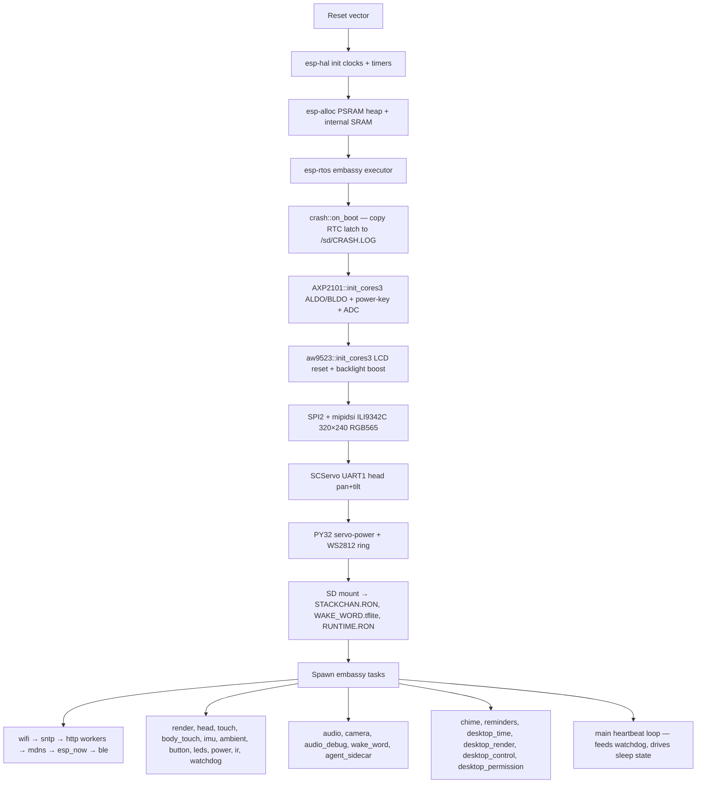

# stackchan-firmware

Binary crate. `no_std` + `alloc`, embassy executor on esp-rtos, runs
on the M5Stack CoreS3 Stack-chan. Boots the hardware, wires up every
driver in the workspace, spawns the embassy task set, and runs the
[`stackchan-core`](../stackchan-core) modifier + skill pipeline at
~30 FPS.

## Layout

`src/main.rs` is the binary entry — heap init, esp-rtos boot, board
init, modifier registration, task spawn, heartbeat loop.
`src/lib.rs` re-exports the per-module surfaces so `examples/*.rs`
benches can share helpers.

| Module | What it does |
|---|---|
| `board.rs`         | One-shot hardware bring-up: AXP2101 → AW9523 → SPI2 ILI9342C via `mipidsi` → SCServo on UART1. Hands back `BoardIo`, `SharedI2c(Bus)`, `HeadDriverImpl`. |
| `framebuffer.rs`   | PSRAM-backed 320×240 RGB565 double-buffer + dirty-check blit. |
| `clock.rs`         | `HalClock` adapter — `embassy_time::Instant` → `stackchan_core::Clock`. |
| `head.rs`          | Embassy task: drains `Pose` signals → SCServo commands. |
| `imu.rs`           | BMI270 task publishing accel/gyro samples on `IMU_SIGNAL`. |
| `touch.rs`         | FT6336U touch task. |
| `body_touch.rs`    | Si12T 3-zone back-of-head capacitive touch, polled at 50 ms. |
| `ir.rs`            | NEC IR decoder on the RMT peripheral. |
| `ambient.rs`       | LTR-553 ambient-light + proximity task. |
| `button.rs`        | AXP2101 power-key edge detector. |
| `leds.rs`          | PY32 WS2812 LED-ring task. |
| `power.rs`         | AXP2101 battery / charge / USB-VBUS sampler. |
| `wallclock.rs`     | Boot-time BM8563 RTC read so the first defmt log line carries an absolute wall time. Per-task RTC consumers (chime, SNTP, desktop-time) own their own reads. |
| `audio.rs`         | I²S0 + AW88298 / ES7210 bring-up. RX RMS loop publishing on `AUDIO_RMS_SIGNAL` and the 20 ms `AUDIO_FRAME_PUBSUB`; TX feeder draining the queued `Box<dyn AudioSource>`s from the speech router. `AUDIO_TX_PLAYING` gates RMS against speaker self-trigger. |
| `audio_debug.rs`   | UDP tee for `AUDIO_FRAME_PUBSUB` — see [docs/audio-debug.md](../../docs/audio-debug.md). Opt-in via `behavior.audio_debug_udp_target`. |
| `camera.rs`        | `LCD_CAM` + DMA capture loop. Each frame publishes on `CAMERA_FRAME_SIGNAL` (LCD preview) and feeds `tracker::Tracker::step`; result on `CAMERA_TRACKING_SIGNAL`. |
| `wake_word.rs`     | On-device wake-word inference, opt-in via `behavior.wake_word_enabled` + presence of `/sd/WAKE_WORD.tflite`. Subscribes to `AUDIO_FRAME_PUBSUB`, runs the streaming mel frontend from [`stackchan-audio-features`](../stackchan-audio-features), and ticks a TFLite-micro interpreter via [`esp-tflite-micro-sys`](../esp-tflite-micro-sys). |
| `agent_sidecar.rs` | Push-to-talk + sidecar HTTP agent client. PTT triggered by `POST /listen` (or MCP `start_listen`); captures PCM, POSTs to `behavior.agent_sidecar_url`, surfaces the reply through the existing `RemoteCommand` channel. |
| `tracking_trace.rs`| `defmt` event catalogue for the `tracking-trace` Cargo feature. |
| `chime.rs`         | Hourly chime task — top-of-hour chirp. Opt-in via `behavior.hourly_chime_enabled`. |
| `reminders.rs`     | Fixed-capacity reminder/timer scheduler; dispatches due entries through `REMOTE_COMMAND_QUEUE`. |
| `toast.rs`         | On-screen toast band; opt-in via `behavior.toast_overlay_enabled`. `push_info`/`push_warn`/`push_error`/`push_toast` from any task. |
| `event_log.rs`     | Bounded RAM ring of operator-visible events; surfaced via `GET /events`. |
| `runtime_store.rs` | `/sd/RUNTIME.RON` writer for fast-changing operator state (palette, mood, face geometry, head offsets) so reboots preserve UI tweaks without churning the boot config. |
| `crash.rs`         | RTC-fast-RAM crash latch + boot-time copy to `/sd/CRASH.LOG`. Surfaces via `GET /crash`. |
| `watchdog.rs`      | Per-channel heartbeat watchdog; warns when a producer task goes silent. |
| `sleep.rs`         | Operator-commanded sleep mode (distinct from autonomous `Dormancy`). |
| `ota.rs`           | OTA path: parses + verifies the SCFW envelope (signature in [`stackchan-net::ota`](../stackchan-net/src/ota.rs)) and stream-writes via `esp-hal-ota`. |
| `storage.rs`       | SD-card `/sd/STACKCHAN.RON` reader + atomic writer (`PUT /settings`). Falls back to `Config::default` so the avatar still boots offline-first. |
| `sd_spi.rs`        | `SdSpiDevice` adapter for the shared SPI2 bus — handles the LCD-DC / SD-MISO dual-role on GPIO35 (M5GFX-style OE flip per CS edge). |
| `desktop_render.rs` | Translates Claude Desktop `Snapshot` / `Tts` / `Toast` messages into avatar affect, toast bands, and TTS chunks. |
| `desktop_control.rs`| Handles `cmd:`-tagged desktop messages (status / owner / name / unpair / folder push / turn events). |
| `desktop_time.rs`  | Writes the desktop's `{"time":[epoch_secs, tz_offset_secs]}` message into the BM8563 RTC. |
| `desktop_permission.rs` | Permission-decision UX: snapshot prompts + back-of-head tap acks; replies on `DESKTOP_OUTBOUND`. |
| `ble/`             | BLE peripheral. `mod.rs` exports `ble_task`; `server.rs` declares the GATT services via `trouble-host` macros; `task.rs` pins the controller type for embassy spawn; `bonds.rs` persists pairing keys to SD; `desktop.rs` holds the per-connection NUS line framer + the `DESKTOP_INBOUND` / `DESKTOP_OUTBOUND` channels for the Hardware Buddy plumbing. |
| `net/`             | Wi-Fi + LAN services. `stack.rs` runs the embassy-net runner; `wifi.rs` handles STA connect; `http.rs` is the hand-rolled HTTP/1.1 server (multi-worker, queues `RemoteCommand`s into `REMOTE_COMMAND_QUEUE`); `mdns.rs` advertises `_stackchan._tcp.local.` and publishes live `yaw=` / `pitch=` TXT; `mdns_follower.rs` consumes a configured leader's TXT for mimic-stack follow; `websocket.rs` implements `GET /state/ws`; `snapshot.rs` rebuilds the read-only avatar snapshot for the HTTP `/state` route; `respond.rs` is the HTTP response builder; `sntp.rs` writes the synced epoch into the RTC; `esp_now.rs` runs the optional ESP-NOW peer-to-peer transport. |

## Boot sequence


```mermaid
flowchart TB
    Start[Reset vector]
    Start --> Hal[esp-hal init clocks + timers]
    Hal --> Heap[esp-alloc PSRAM heap + internal SRAM]
    Heap --> Rtos[esp-rtos embassy executor]
    Rtos --> Crash[crash::on_boot — copy RTC latch to /sd/CRASH.LOG]
    Crash --> Pmic[AXP2101::init_cores3 ALDO/BLDO + power-key + ADC]
    Pmic --> Exp[aw9523::init_cores3 LCD reset + backlight boost]
    Exp --> Lcd[SPI2 + mipidsi ILI9342C 320×240 RGB565]
    Lcd --> Servo[SCServo UART1 head pan+tilt]
    Servo --> Py[PY32 servo-power + WS2812 ring]
    Py --> Sd[SD mount → STACKCHAN.RON, WAKE_WORD.tflite, RUNTIME.RON]
    Sd --> Spawn[Spawn embassy tasks]
    Spawn --> Net[wifi → sntp → http workers → mdns → esp_now → ble]
    Spawn --> Sense[render, head, touch, body_touch, imu, ambient, button, leds, power, ir, watchdog]
    Spawn --> AudioCam[audio, camera, audio_debug, wake_word, agent_sidecar]
    Spawn --> Affordances[chime, reminders, desktop_time, desktop_render, desktop_control, desktop_permission]
    Spawn --> Main[main heartbeat loop — feeds watchdog, drives sleep state]
```

The avatar boots fully and animates with no SD card and no Wi-Fi; the
network services park themselves until link-up, and the avatar tasks
spawn first so face + motor stay responsive throughout.

## Modifier + skill registration

The render task constructs a [`Director`] and registers the canonical
modifier stack plus three skills. Phase ordering
(`Affect → Expression → Decoration → Motion → Audio`) is enforced by
the Director's sort regardless of registration order; the firmware
list is grouped by phase for readability. The source of truth is the
sequence of `director.add_modifier(...)` / `add_skill(...)` calls in
`src/main.rs` — `git grep "add_modifier\|add_skill" src/main.rs`
lists the current registry. New modifiers / skills land via that
list rather than via Director edits.

Inputs arrive through embassy `Signal` / `PubSubChannel` channels
from the per-peripheral tasks; the render task drains the latest
value from each signal into `entity.perception` / `entity.input`,
calls [`Director::run`], then dispatches the post-frame sinks (LCD
blit, head pose, LED frame, audio queue).

## Network surface

Once Wi-Fi connects (SSID + PSK from `/sd/STACKCHAN.RON`), the
firmware runs these services on the LAN:

- **HTTP** on port 80 — operator dashboard at `GET /` (TS + Solid
  bundle from `../../web`, embedded gzipped at compile time), live
  state on `/state` + `/state/stream` (SSE) + `/state/ws`
  (WebSocket), control plane on `/emotion`, `/look-at`, `/reset`,
  `/speak`, `/settings`, `/dance`, `/motion`, `/face-geometry`,
  `/listen`, `/toast`, `/mcp`, `/health`, `/events`, `/crash`,
  `/ota`. Write routes (`PUT`, `POST`) are gated on `auth.token`
  from the boot config — empty token (default) leaves the LAN open;
  non-empty token requires `Authorization: Bearer <token>`. Full
  route table, body shapes, error codes in
  [docs/http.md](../../docs/http.md).
- **mDNS** — advertises `<hostname>.local` (A) plus the DNS-SD
  service `_stackchan._tcp.local.` (PTR / SRV / TXT) from
  `mdns.hostname`. The TXT record carries `kai=1` as a variant
  marker plus live `yaw=<deg>` / `pitch=<deg>` (one decimal,
  throttled to at most 100 ms with a 1 s heartbeat) so a follower
  in a mimic stack can lift current pose off mDNS without an HTTP
  round-trip.
- **mDNS follower** — opt-in via `behavior.follower_leader_hostname`.
  Subscribes to mDNS announcements from a named leader and mirrors
  their commanded yaw / pitch into the local motor.
- **SNTP** — on link-up, queries `time.sntp_servers` and writes the
  result into the BM8563 RTC.
- **ESP-NOW** — opt-in via `esp_now.enabled`. Frame envelope shared
  with HTTP (see [`stackchan-net::esp_now`](../stackchan-net/src/esp_now.rs)).
- **Sidecar agent client** — opt-in via `behavior.agent_sidecar_url`.
  POST-to-talk: on `POST /listen` the firmware captures PCM, POSTs
  to the configured sidecar, and surfaces the reply through
  `REMOTE_COMMAND_QUEUE`. See [docs/voice.md](../../docs/voice.md).

The boot config schema lives in
[`stackchan-net`](../stackchan-net) and round-trips between the
SD-card RON file and the HTTP `/settings` JSON.

## BLE peripheral

In parallel with Wi-Fi, the device advertises a BLE peripheral named
`Claude stk-XXXXXX` (last three Wi-Fi MAC bytes). The `Claude `
prefix is required for Claude Desktop's Hardware Buddy picker to
filter the device in; the mDNS hostname (`stackchan-XXXXXX` by
default) is configured separately.

Services exposed:

- **Device Information** (`0x180A`) — manufacturer / model /
  firmware revision.
- **Battery** (`0x180F`).
- **Stack-chan custom service** — emotion read + notify.
- **Wi-Fi provisioning** — SSID + PSK writes for first-boot
  bootstrapping, plus BluFi support for the official Espressif
  provisioning apps.
- **Audio** (`8a1c0020-…`) — volume + mute read/write/notify.
- **Avatar control** (`8a1c0030-…`) — emotion / look-at / reset /
  speak writes.
- **View** (`8a1c0040-…`) — LCD camera-preview / avatar toggle and
  a capture trigger (writes the latest QVGA RGB565 frame to
  `/sd/CAPTURE.565`).
- **Nordic UART Service (NUS)** — newline-delimited JSON for the
  Claude Desktop Hardware Buddy plumbing. The per-connection
  `DesktopSession` line-frames incoming ATT writes and publishes
  `Inbound` messages on `DESKTOP_INBOUND` (a `PubSubChannel` with
  three subscribers today — `desktop_render`, `desktop_control`,
  `desktop_permission`). `desktop_control` parses any `TimeSync`
  message and forwards the epoch to `desktop_time` via a separate
  `DESKTOP_RTC_WRITE_REQUEST` signal so the RTC writer holds its
  own `I2cDevice` handle on the BM8563. Outbound replies come back
  through `DESKTOP_OUTBOUND` and render on the NUS TX
  characteristic.

Control writes require an authenticated bond (passkey-confirmed
pairing); bonds persist across reboots via `/sd/BONDS.BIN`. The
notify task diffs the avatar snapshot every tick so subscribed
centrals see HTTP-side changes without polling. Wi-Fi and BLE share
the radio via `esp-radio`'s coex scheduler; expect a small Wi-Fi
airtime tax when a BLE central is connected.

## I²C bus sharing

All I²C peripherals share one `SharedI2cBus` (`Mutex<NoopRawMutex,
I2c<'static, Async>>`) and talk to it through `I2cDevice` handles.
Addresses on the bus:

| Address | Chip |
|---|---|
| `0x10/11` | BMM150 magnetometer (bench-only on this unit) |
| `0x23`    | LTR-553 ambient / proximity |
| `0x34`    | AXP2101 PMIC |
| `0x36`    | AW88298 amp (control path; I²S0 streams audio) |
| `0x38`    | FT6336U touch |
| `0x40`    | ES7210 ADC (control path; I²S0 streams audio) |
| `0x51`    | BM8563 RTC |
| `0x58`    | AW9523 I/O expander |
| `0x68`    | Si12T 3-zone body touch (probe-time; driver address is `0x50`) |
| `0x69`    | BMI270 IMU (also responds at `0x68`; bench arbitrates) |
| `0x6F`    | PY32 co-processor |

## Build + flash

```bash
source ~/export-esp.sh       # adds the esp Xtensa toolchain to PATH
just check-firmware          # cargo +esp check
just clippy-firmware         # cargo +esp clippy --release -- -D warnings (CI parity)
just build-firmware          # cargo +esp build --release
just fmr                     # flash + monitor in one go
just reattach                # attach to a running device without resetting
just PORT=/dev/ttyACM0 fmr   # override default port
```

Per-bench recipes flash a single `examples/*_bench.rs` to exercise
one driver in isolation: `just bench` (servo calibration), `just
mag-bench`, `just leds-bench`, `just aw88298-bench`, `just
es7210-bench`, `just audio-bench`, `just tilt-extremes`, `just
tilt-freewheel`, plus `face-bench`, `i2c-probe`, `imu-bench`,
`ir-bench`, `si12t-bench`, `touch-bench`, `tracker-bench`. List
all: `just`.

`just fmr` runs an interactive monitor (espflash). When invoked from
a non-TTY shell (any agent-spawned bash), launch inside a tmux
session — see [CLAUDE.md](../../CLAUDE.md#flashing-from-an-agent--non-tty-shell)
for the recipe.

### Cargo features

- **`tracking-trace`** — emits structured `defmt` events from the
  camera-tracking pipeline (attention + engagement transitions,
  lock-fire latency, observation cadence). Off by default. Filter
  the live stream with `grep trk:`. Catalog in `src/tracking_trace.rs`.

## Gotchas

1. **`unsafe` is allowed per-module, reason-tagged.** The crate's
   `#![deny(unsafe_code)]` has per-module exceptions for the
   app-descriptor LTO anchor and register-map pointer work. Each
   exception carries a comment explaining why.
2. **Render path is dirty-checked.** `framebuffer` only blits when the
   `Entity::draw` pixels change from the previous frame.
   `Face::frame_eq` excludes non-pixel-affecting fields; new fields
   default to *excluded* unless they affect drawing.
3. **PSRAM holds the framebuffer.** Internal SRAM is reserved for
   ISR / real-time paths. 320×240×2 bytes = 153 KB wouldn't fit in
   SRAM regardless.
4. **Many tasks share `SharedI2cBus`.** Touch / IMU / ambient / power
   / button / LED / body-touch / RTC tasks all hold `I2cDevice`
   handles onto the same I²C0 bus; the `embassy-embedded-hal` mutex
   serialises access. Polling tasks run at ≤50 Hz so contention stays
   negligible for the 30 FPS render task.
5. **`panic!` is the error layer at `main`.** Firmware `main` can't
   bubble init failures to a caller, so init errors panic. Module
   code returns typed errors (see [docs/errors.md](../../docs/errors.md));
   the panic rule only applies at the `#[no_main]` boundary. The
   `crash` module catches the panic message into RTC fast RAM and
   persists it to `/sd/CRASH.LOG` on the next boot.
6. **Log timestamps come from embassy-time.** `defmt::timestamp!`
   captures `embassy_time::Instant::now().as_millis()`, which starts
   from esp-rtos boot. No wall-clock alignment unless `wallclock_task`
   has set the RTC.
7. **GPIO35 dual-role.** Same pin serves LCD DC and SD MISO; the
   `sd_spi` adapter flips the OE bit per CS edge (M5GFX-style).
   Don't expose GPIO35 to a generic embedded-hal SPI device unless
   it goes through `SdSpiDevice`.
8. **Watchdog beats are advisory.** A silent producer task surfaces
   as a `defmt::warn!`, not a hardware reset. Hardware reset is the
   ESP32-S3's task watchdog, separately configured by esp-rtos.

## Integration

- **Consumes [`stackchan-core`](../stackchan-core)** for every
  domain type (`Entity`, `Director`, `Modifier`, `Skill`, `Pose`,
  `Clock`, `HeadDriver`, `LedFrame`).
- **Consumes every driver crate in the workspace** — `axp2101`,
  `aw9523`, `aw88298`, `bm8563`, `bmi270`, `es7210`, `ft6336u`,
  `gc0308`, `ir-nec`, `ltr553`, `py32`, `scservo`, `si12t`. ES7210
  streams RX over I²S0 into the audio task; AW88298 streams TX
  (silence between queued sources). `gc0308` streams continuously
  into `camera_task`, where `tracker` runs block-grid motion analysis
  on every frame and publishes `TrackingObservation` for the engine.
  `bmm150` is bench-only on this unit (`examples/mag_bench.rs`).
- **Consumes [`stackchan-net`](../stackchan-net)** for every wire
  format (boot config, HTTP body parsers, MCP, BLE characteristic
  codecs, BluFi, ESP-NOW, OTA header, crash latch, mDNS pose TXT,
  dance JSON).
- **Consumes [`stackchan-tts`](../stackchan-tts)** for the
  `SpeechBackend` trait and the `BakedBackend` (sine SFX + verbal
  phrase PCM).
- **Consumes [`stackchan-audio-features`](../stackchan-audio-features)**
  for the wake-word frontend mel spectrogram.
- **Consumes [`stackchan-desktop-protocol`](../stackchan-desktop-protocol)**
  for the Hardware Buddy NUS message parsing + rendering.
- **Consumes [`esp-tflite-micro-sys`](../esp-tflite-micro-sys)** for
  the wake-word TFLite-micro interpreter.
- **Consumes [`tracker`](../tracker)** for the block-grid motion
  tracker on the camera path.
- **Stability:** Experimental in v0.x. Module structure and the
  task spawn shape are settled; individual feature flags + behavior
  defaults continue to evolve.

[`Director`]: ../stackchan-core/src/director.rs
[`Director::run`]: ../stackchan-core/src/director.rs
