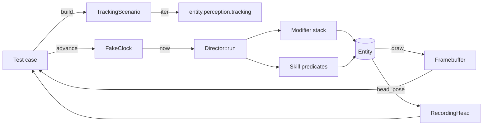

# stackchan-sim

Host-side simulator for [`stackchan-core`](../stackchan-core). Runs the
full modifier + skill pipeline against a deterministic clock and an
in-memory framebuffer, so most of the firmware's behaviour is
exercised in `cargo test` on the dev machine — no hardware, no
flashing, no embedded toolchain. The crate is `publish = false`; it
exists to back the integration tests in `tests/` and the optional
`viz` host visualiser.

## What's here

- [`FakeClock`] — deterministic [`Clock`] backed by a `Cell<Instant>`.
  `advance(delta_ms)` and `set(instant)` are the only ways time
  moves. `now()` is `&self` (so [`Director::run`] can call it
  without `&mut`).
- [`Framebuffer`] — `width × height` `Vec<Rgb565>` that implements
  `embedded_graphics::DrawTarget<Color = Rgb565>` with `Infallible`
  errors. Pixels outside the buffer are silently clipped, matching
  `embedded-graphics`'s own clip behaviour. `pixel(x, y) → Option<Rgb565>`
  for read-back.
- [`RecordingHead`] — [`HeadDriver`] impl that pushes every
  `(Instant, Pose)` call into a `Vec`, so motion-modifier tests
  can assert on the full trajectory rather than a single sample.
- [`TrackingScenario`] — replayable sequence of [`TrackingObservation`]
  values built from `silent` / `tracking` / `with_face` / `holding` /
  `returning` blocks. Iterates `(Instant, Option<TrackingObservation>)`
  per tick at the configured cadence (default 33 ms ≈ 30 FPS), ready
  to write into `entity.perception.tracking` before each
  `Director::run`.
- [`block_on`] — minimal future executor for synchronously driving
  an always-`Ready` `HeadDriver::set_pose`. Spins on `Pending` so
  misuse surfaces immediately; the intended caller is
  [`RecordingHead`].

## Tick model



The simulator never owns the modifier registry — tests construct
their own [`Director`], register the modifiers + skills under test,
and drive the loop themselves. That matches the firmware's render
task shape and keeps each test scoped to the contract it pins.

## Integration tests

`tests/*.rs` is the bulk of the crate. Each file is one or more
`#[test]` cases driven through [`Director::run`]:

| File | What it pins |
|---|---|
| `attention_from_tracking.rs` | `AttentionFromTracking` priorities + the tracking-doesn't-stomp-Listening invariant |
| `ble_remote_command.rs`      | BLE characteristic payloads decode (via [`stackchan-net`](../stackchan-net)) → `RemoteCommand` → entity transitions match the HTTP path |
| `body_gesture.rs`            | `IntentFromBodyTouch` Press / Swipe / Release state machine off [`Si12T`-shaped](../si12t) perception |
| `dance.rs`                   | `POST /dance` JSON → `DanceScript` → `DancePlayer` → frame-by-frame motor pose |
| `dormancy_head_drift.rs`     | `DormancyFromActivity` gates `IdleHeadDrift` so dormancy actually stills the servo |
| `face_geometry.rs`           | `POST /face-geometry` JSON → [`FaceGeometry`] preset → `Face::set_geometry` applies |
| `gaze_from_attention.rs`     | `GazeFromAttention` saccade trajectory |
| `head_from_attention.rs`     | `HeadFromAttention` pose handoff from cognition to motor |
| `idle_head_drift.rs`         | Per-axis glance amplitude + rest-time distribution under `IdleHeadDrift` |
| `intent_from_loud.rs`        | Loud-noise startle: `Intent::Startled` + `Emotion::Surprised` + `ChirpKind::Startle` + head recoil + LED override fire together |
| `leds.rs`                    | `render_leds` colour buffer regression |
| `listening.rs`               | `Listening` skill + `HeadFromAttention` handoff under audio RMS |
| `lost_target_search.rs`      | `LostTargetSearch` saccade after a tracked target disappears |
| `microsaccade_from_attention.rs` | `MicrosaccadeFromAttention` cadence + amplitude |
| `mood_style_chain.rs`        | `StyleFromMood` actually modulates `blink_rate_scale` / `breath_depth_scale` on top of `StyleFromEmotion` |
| `petting.rs`                 | `IntentFromBodyTouch` (modifier) and `Petting` (skill) compose without conflict on the same body-touch input |
| `remote_command.rs`          | HTTP-plane `RemoteCommand` variants → motor pose, decorator, emotion outcomes |
| `render_snapshot.rs`         | `Entity::draw` into a 320×240 framebuffer, asserts on hand-picked pixels (eye centres, mouth line, corner) |
| `tracking_handoff.rs`        | Full tracking arc: `AttentionFromTracking` + `GazeFromAttention` + `MicrosaccadeFromAttention` + `HeadFromAttention` + `LostTargetSearch` composed with the standard background stack |

In-module `#[cfg(test)]` blocks inside `lib.rs` cover the simulator's
own utilities (`Framebuffer` out-of-bounds clipping, `RecordingHead::clear`,
`TrackingScenario::tick_ms`) plus a handful of cross-cutting Director
tests (60 s composition stability, distinct-seed `IdleDrift`
divergence, blink frequency over one minute, `StyleFromEmotion → Blink`
single-tick propagation, voice-loop `Listen → Think → Reply` clearing
thinking, emotion-driven decorator lifecycle).

## Host visualiser

Optional `viz` binary, behind the `viz` Cargo feature:

```bash
cargo run -p stackchan-sim --bin viz --features viz
```

Opens an `eframe` (egui + winit) window and runs the firmware-side
modifier stack at 30 FPS so behaviour changes iterate in sub-second
cycles instead of the ~30 s build → flash → boot loop. Behind a feature
flag so the default lib build (and CI host tests) stay free of the
windowing dep tree.

## Gotchas

1. **`FakeClock` is not monotonic-enforcing.** `set()` trusts the
   caller; a test can intentionally go backward to exercise a
   pathological path. Assertions need to know what they're
   asserting.
2. **`Framebuffer` clipping is silent.** Pixels written outside
   `width × height` don't error — they disappear. Size the buffer
   to match the firmware's 320×240 when running render snapshots.
3. **`RecordingHead` is unbounded.** Long-running tests accumulate
   `(Instant, Pose)` entries indefinitely; call `clear()` between
   phases, or cap the simulated duration.
4. **`TrackingScenario` block durations floor to `tick_ms`.** A
   `duration_ms` block produces `floor(duration_ms / tick_ms)` ticks
   at `0, tick_ms, …, (count-1)*tick_ms`. Use
   [`TrackingScenario::duration_for_ticks`] to size a block to
   produce exactly `N` ticks without redoing the math by hand.
5. **`block_on` does not yield.** It spins on `Pending`, which is the
   point — the intended callers (`RecordingHead::set_pose`) return
   immediately-`Ready` futures and a `Pending` means real I/O leaked
   into the test path.

## Integration

- Depends on [`stackchan-core`](../stackchan-core) for the engine
  types and [`stackchan-net`](../stackchan-net) (dev-only) for the
  BLE / dance / face-geometry wire-format round trips.
- The full sim suite runs as part of `just check` (and on every
  CI host job); no hardware required.
- **Stability:** Experimental in v0.x. The `FakeClock` / `Framebuffer`
  / `RecordingHead` shapes are settled; `TrackingScenario`'s builder
  API is still evolving alongside the tracker.

[`FakeClock`]: src/lib.rs
[`Framebuffer`]: src/lib.rs
[`RecordingHead`]: src/lib.rs
[`TrackingScenario`]: src/lib.rs
[`TrackingScenario::duration_for_ticks`]: src/lib.rs
[`block_on`]: src/lib.rs
[`Clock`]: ../stackchan-core/src/clock.rs
[`HeadDriver`]: ../stackchan-core/src/head.rs
[`TrackingObservation`]: ../stackchan-core/src/perception.rs
[`Director`]: ../stackchan-core/src/director.rs
[`Director::run`]: ../stackchan-core/src/director.rs
[`FaceGeometry`]: ../stackchan-core/src/face.rs
