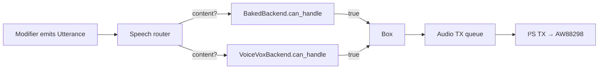

# stackchan-tts

Speech synthesis layer for the Stack-chan firmware. Defines the trait
surfaces the audio task runs against, plus the in-tree backends. Domain
types ([`Utterance`], [`PhraseId`], [`Locale`], [`SpeechContent`],
[`SpeechStyle`], [`Priority`], [`ContentRef`]) live in
[`stackchan-core::voice`](../stackchan-core/src/voice.rs); this crate
turns them into audible PCM.

`no_std` with unconditional `alloc` — `Box<dyn AudioSource>` is the
queue element type the firmware audio router pulls from.

## What's here

- [`AudioSource`] — pull-based 16-bit mono PCM stream at the audio
  task's configured sample rate (16 kHz on the CoreS3). `fill(buf) →
  usize` writes into a caller-owned buffer; `0` means exhausted.
  Optional [`AudioSource::lip_sync`] hint (envelope + viseme) lets a
  backend ship pre-computed lipsync alongside the audio.
- [`SpeechBackend`] — resolves an [`Utterance`] into an
  [`AudioSource`]. The firmware speech router pattern-matches on
  [`SpeechContent`] and forwards to the first backend whose
  [`SpeechBackend::can_handle`] returns `true`.
- [`BakedBackend`] — in-tree backend for [`SpeechContent::Phrase`]
  catalog entries. Renders non-verbal SFX from compile-time sine-cycle
  tables, and verbal phrases from `include_bytes!`-embedded raw PCM
  under `assets/<locale>/<phrase>.pcm`.
- [`VoiceVoxBackend`] — wire-format + WAV-parsing scaffolding for
  self-hosted [`VoiceVox`] (and API-compatible engines like
  [`AivisSpeech`]). [`SpeechBackend::render`] is currently
  [`RenderError::BackendUnavailable`] until the async HTTP fetcher
  task lands on the firmware side; the URL builders and WAV parser
  are host-testable today.
- [`LipSync`] + [`Viseme`] re-exports from `stackchan-core::lipsync`
  so backends and the firmware audio task share one envelope shape.

## Dispatch

Backends are checked in registration order; the first `true` wins.
The audio task pulls one source at a time, draining via `fill()` into
the DMA buffer until the source returns `0`, then dropping it and
advancing to the next queued source.

## Baked catalogue

`BakedBackend` ships two flavours:

**Non-verbal SFX** — single-cycle sine tables (`SINE_1KHZ`,
`SINE_2KHZ`, `SINE_4KHZ`, `SILENCE_8`) looped N times via
[`SineTableSource`] and composed into multi-segment patterns by
[`SineSequence`]. Used for chirps and short notification tones — keeps
the firmware crate free of `libm`. Tables live in `baked.rs`; the
backend renders them from a [`PhraseId`] variant match.

**Verbal phrases** — raw 16 kHz / 16-bit / mono PCM committed under
`assets/<locale>/<phrase_id>.pcm`. The source-of-truth text is in
[`assets/manifest.toml`](assets/manifest.toml); `just bake-tts` regenerates
the `.pcm` files via Piper. To add a phrase: add a [`PhraseId`]
variant, add a `render` arm to `BakedBackend`, add a `[<phrase_id>]`
entry to the manifest with text per locale, run `just bake-tts`,
commit the generated `.pcm`s.

## VoiceVox

`VoiceVoxBackend` targets self-hosted [`VoiceVox`] and any
API-compatible engine. The protocol is two HTTP round-trips —
`POST /audio_query?speaker=<id>&text=<utf8>` returns a JSON prosody
description; `POST /synthesis?speaker=<id>` with that JSON as the body
returns a WAV file. This module ships:

- [`audio_query_path`] / [`synthesis_path`] — URL builders (paths +
  query strings). Caller wraps in a full URL.
- [`VoiceVoxConfig`] — `host` + `port` + `speaker_id` settings.
  Defaults: port `50_021`, speaker `1` (Zundamon "ノーマル").
- [`parse_wav`] / [`WavHeader`] / [`WavError`] — RIFF-chunk WAV
  parser that locates the PCM payload inside a synthesis response.
- [`BufferedSource`] — [`AudioSource`] that wraps a `Vec<i16>` of
  decoded samples, suitable for handing back from a future async
  fetcher task.

The async fetcher itself lives in the firmware crate and isn't
shipped yet, so [`VoiceVoxBackend::render`] returns
[`RenderError::BackendUnavailable`]. The URL builders + WAV parser
are exercised by host tests today.

## Gotchas

1. **No `libm` in baked SFX.** Sine cycles are pre-baked at compile
   time so the firmware crate doesn't pull `libm`. A future backend
   that needs trig at runtime should depend on `libm` explicitly.
2. **Sample format is fixed.** 16-bit signed mono at 16 kHz, baked
   into [`AudioSource::fill`]'s `&mut [i16]` signature. Backends that
   want other rates / channel counts must resample at the boundary.
3. **`SpeechBackend::render` is sync; HTTP is async.** Backends that
   need network I/O (`VoiceVoxBackend`) split the work between an
   async firmware-side fetcher task and a sync `render` that returns
   a [`BufferedSource`] over the already-fetched samples.
4. **`can_handle` must be cheap.** It runs on every utterance to
   gate dispatch. Backends that need expensive state (cache lookups,
   handle validation) do that inside `render`, not `can_handle`.
5. **PCM assets are large.** Each verbal phrase costs `bytes-per-sec
   * duration` of flash; the firmware's flash budget is the limit, not
   PSRAM. Profile with `cargo size` when adding long phrases.

## Integration

- Depends only on [`stackchan-core`](../stackchan-core) for the
  domain types.
- The firmware speech router lives in [`stackchan-firmware`'s audio
  task](../stackchan-firmware/src/audio.rs); modifiers in
  `stackchan-core` publish [`Utterance`]s via
  [`Voice::utterance_request`] and the router drains them through
  the registered backends.
- **Stability:** Experimental in v0.x. The trait shapes
  ([`AudioSource`], [`SpeechBackend`]) are settled; the
  [`VoiceVoxBackend`] surface will move as the async fetcher lands.

[`AudioSource`]: src/source.rs
[`AudioSource::fill`]: src/source.rs
[`AudioSource::lip_sync`]: src/source.rs
[`SpeechBackend`]: src/backend.rs
[`SpeechBackend::can_handle`]: src/backend.rs
[`SpeechBackend::render`]: src/backend.rs
[`RenderError`]: src/backend.rs
[`RenderError::BackendUnavailable`]: src/backend.rs
[`BakedBackend`]: src/baked.rs
[`SineTableSource`]: src/baked.rs
[`SineSequence`]: src/baked.rs
[`VoiceVoxBackend`]: src/voicevox.rs
[`VoiceVoxBackend::render`]: src/voicevox.rs
[`VoiceVoxConfig`]: src/voicevox.rs
[`audio_query_path`]: src/voicevox.rs
[`synthesis_path`]: src/voicevox.rs
[`parse_wav`]: src/voicevox.rs
[`WavHeader`]: src/voicevox.rs
[`WavError`]: src/voicevox.rs
[`BufferedSource`]: src/voicevox.rs
[`Utterance`]: ../stackchan-core/src/voice.rs
[`PhraseId`]: ../stackchan-core/src/voice.rs
[`Locale`]: ../stackchan-core/src/voice.rs
[`SpeechContent`]: ../stackchan-core/src/voice.rs
[`SpeechContent::Phrase`]: ../stackchan-core/src/voice.rs
[`SpeechStyle`]: ../stackchan-core/src/voice.rs
[`Priority`]: ../stackchan-core/src/voice.rs
[`ContentRef`]: ../stackchan-core/src/voice.rs
[`Voice::utterance_request`]: ../stackchan-core/src/voice.rs
[`LipSync`]: ../stackchan-core/src/lipsync.rs
[`Viseme`]: ../stackchan-core/src/lipsync.rs
[`VoiceVox`]: https://voicevox.hiroshiba.jp/
[`AivisSpeech`]: https://github.com/Aivis-Project/AivisSpeech-Engine
