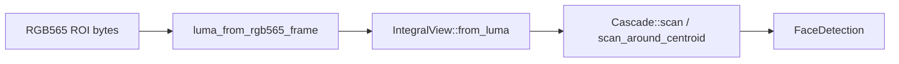

# tracker

`no_std` camera-side analysis for the Stack-chan. Two layers, both
allocation-free and host-testable from synthesised fixtures:

- **Block-grid motion tracker** ([`Tracker`]) — consumes raw RGB565
  QVGA frames, computes inter-frame motion via per-block luma
  deltas, and emits a target [`Pose`] for the head servos. Pure
  algorithm; the firmware ties it into the gc0308 + `LCD_CAM` DMA
  loop.
- **Pure-Rust Viola–Jones cascade** ([`cascade`]) — integer-arithmetic
  face detector. Cascade weights are baked into the crate as
  [`FRONTAL_FACE`], pre-converted from OpenCV's
  `haarcascade_frontalface_default.xml` by `xtask-cascade-convert`.
  Used by the firmware to confirm "is there actually a face here?"
  on top of the motion centroid.

## Layout

| Module | What it does |
|---|---|
| `lib.rs`          | `TrackerConfig`, `Tracker`, `Outcome`, `Motion`, `TargetCandidate`, plus the control law (P-gain + dead zone + per-step slew + idle-timeout return-to-centre + optional EMA on the published target) |
| `luma.rs`         | RGB565 → 8-bit luma via shifts-only Rec. 601 approximation (`(R8 + 2·G8 + B8) >> 2`); `fill_block_luma` reduction over a configurable `blocks_x` × `blocks_y` grid (≤ 16 × 16) |
| `cascade.rs`      | Viola–Jones scorer: `Rect`, `Feature`, `Stump`, `Stage`, `Cascade`, `IntegralView`, `CascadeScratch`, `FaceDetection`, `Cascade::evaluate`, `Cascade::scan`, `scan_around_centroid` |
| `cascade_data.rs` | Bake of `FRONTAL_FACE` — the cascade itself as `const` data |
| `data/`           | Source XML for the cascade (kept in-tree so the bake is reproducible) |

## Motion pipeline

For each `Tracker::step(frame, dt_ms)`:

1. **Per-block mean luma.** Reduce the frame into a small grid
   (default 8 × 6 → 40 × 40 pixel cells over QVGA).
2. **Per-block delta vs. previous frame.** A block whose normalised
   delta exceeds `block_threshold` "fires".
3. **Centroid of fired cells.** Mapped to `[-1, 1]` per axis.
4. **Reject global events.** If too many cells fire (default > 70%),
   the frame is treated as a lighting flip and the pose held.
5. **Dead zone + P-gain + slew clamp.** Centroid → pan/tilt delta via
   the configured camera FOV; small offsets pass through the dead
   zone untouched, the rest scale by `p_gain` and clamp to
   `±max_step_deg`. Result feeds the internal accumulator pose.
6. **Idle timeout.** After `idle_timeout_ms` of no motion, the
   target slews back toward [`Pose::NEUTRAL`] at `idle_step_deg`
   per step.
7. **`Pose::clamped`.** Final assignment routes through the
   `stackchan-core` safe-range clamp (asymmetric tilt — see
   `stackchan_core::head`).
8. **Optional EMA on the published target.** A single-pole
   `target_smoothing_alpha` on [`TrackerConfig`] blends the
   accumulator into the value emitted in `Outcome.target` and
   surfaced via [`Tracker::target_pose`]. Default `1.0` is a no-op;
   lower values add inertia on top of the per-step P-gain.

`Outcome` carries the current motion class ([`Motion::Tracking`] /
[`Motion::Holding`] / [`Motion::Returning`] / [`Motion::Idle`]),
the fired-cell count, and a [`heapless::Vec<TargetCandidate,
MAX_CANDIDATES>`] of secondary attention candidates ranked by
salience.

## Face cascade

Cascade evaluation uses OpenCV's variance-normalisation convention
(`threshold × variance_norm × window_area`,
`variance_norm = sqrt(sumSqs · area − sum²)`), so the converter pipes
weights through verbatim without rescaling. Scales sweep in Q16.16
fixed-point — defaults in `SCAN_MIN_SCALE_Q16` /
`SCAN_MAX_SCALE_Q16` / `SCAN_SCALE_STEP_Q16` / `SCAN_PIXEL_STEP`.

[`Cascade::scan`] sweeps a full ROI; [`scan_around_centroid`] is the
hot path used by the firmware — it scans a small window around the
motion tracker's centroid so face confirmation runs every frame
inside the existing tracking budget.

## Sign conventions

Inherited from `stackchan_core::head`:

- `+pan_deg` → head turns *right* from the viewer's POV.
- `+tilt_deg` → head nods *up* (chin rises). `MIN_TILT_DEG = 0`, so
  the tracker can ask for a downward look but `Pose::clamped` pins
  it to level.
- Centroid `nx > 0` ⇒ motion right of frame centre ⇒ pan delta `> 0`.
- Centroid `ny > 0` ⇒ motion below frame centre ⇒ tilt delta `< 0`
  (head nods down — clamped to 0 in practice).

Frames are assumed column-major byte-pairs in big-endian RGB565
(`LCD_CAM`'s default). Mirrored cameras correct via
[`TrackerConfig::flip_x`] / [`TrackerConfig::flip_y`].

## Gotchas

1. **Motion detection localises to the midpoint, not the new
   position.** Fast left-to-right travel fires blocks at both ends,
   biasing the centroid toward the centre. For typical Stack-chan
   use (people entering frame, slow scene change) this works well;
   running-mean background subtraction is the upgrade path.
2. **Default grid is coarse.** 8 × 6 over QVGA puts angular
   resolution at ~7° per cell on a 62° H FOV — fine enough for slow
   head tracking, coarse for precise saccades.
3. **Cascade requires the variance-normalised threshold form.** A
   converter that emitted raw thresholds (no `variance_norm`
   multiplier) would silently halve / double detection counts. The
   `xtask-cascade-convert` bake is the source of truth.
4. **`Tracker::step` allocates nothing.** Outputs ride in fixed
   `heapless::Vec<…, MAX_CANDIDATES>` slots and on-stack
   `CascadeScratch`. Don't add `Box<…>` types to the public
   surface.
5. **`libm` is the only float-math dep.** Cascade variance-norm needs
   `sqrt`; everything else stays integer. New code that wants `cos`
   / `exp` etc. should grow a wrapper rather than reaching for it
   ad-hoc.

## Integration

- Depends on [`stackchan-core`](../stackchan-core) only for `Pose`
  and the safe-range constants.
- The firmware's [`camera_task`](../stackchan-firmware/src/camera.rs)
  calls `Tracker::step` per captured frame and publishes the
  `Outcome`-derived `TrackingObservation` on `CAMERA_TRACKING_SIGNAL`.
- `examples/tracker_bench.rs` in the firmware crate (run via
  `just tracker-bench`) drives the tracker end-to-end against the
  live GC0308 + `LCD_CAM` camera task and logs proposed poses
  without driving any servo, for empirical tuning.
- Default `TrackerConfig::DEFAULT` is tuned for QVGA GC0308 +
  Stack-chan SCServo head on a CoreS3.
- **Stability:** Experimental in v0.x. The motion-pipeline shape is
  settled; cascade scoring is recent and may move as more models are
  added.

[`Tracker`]: src/lib.rs
[`Tracker::step`]: src/lib.rs
[`Tracker::target_pose`]: src/lib.rs
[`TrackerConfig`]: src/lib.rs
[`TrackerConfig::flip_x`]: src/lib.rs
[`TrackerConfig::flip_y`]: src/lib.rs
[`Outcome`]: src/lib.rs
[`Motion`]: src/lib.rs
[`Motion::Tracking`]: src/lib.rs
[`Motion::Holding`]: src/lib.rs
[`Motion::Returning`]: src/lib.rs
[`Motion::Idle`]: src/lib.rs
[`cascade`]: src/cascade.rs
[`Cascade::scan`]: src/cascade.rs
[`scan_around_centroid`]: src/cascade.rs
[`FRONTAL_FACE`]: src/cascade_data.rs
[`Pose`]: ../stackchan-core/src/head.rs
[`Pose::NEUTRAL`]: ../stackchan-core/src/head.rs
